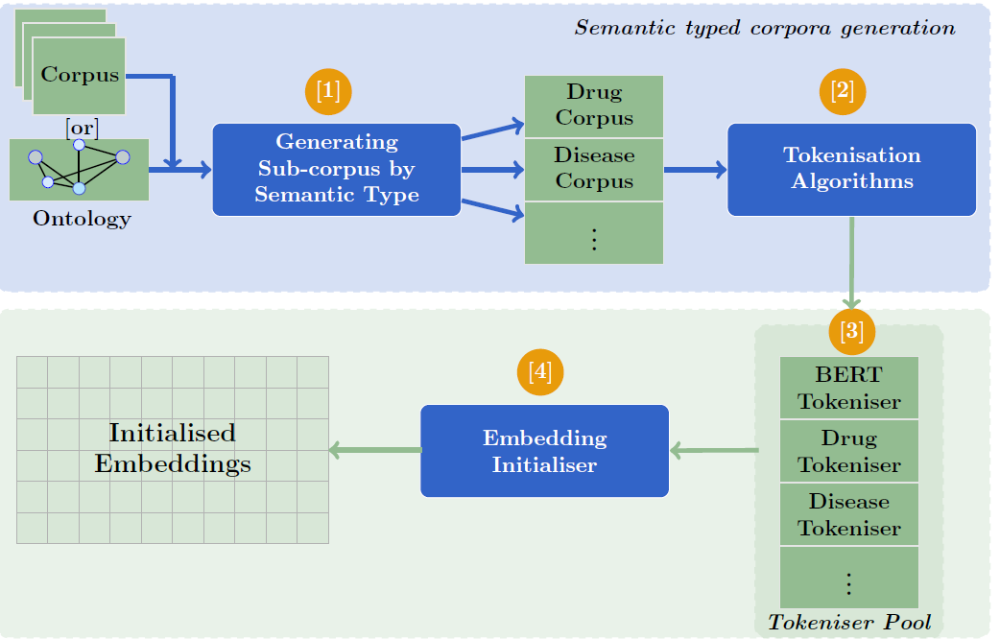

## K-Tokeniser

A tokenisation framework for clinical text processing

## Overview

K-Tokenizer is a modular framework designed to perform robust tokenisation on clinical text. It supports a variety of downstream clinical NLP tasks by providing specialised tokenisation routines.
<figure>
  
  <figcaption>Figure 1: Overview of the K-Tokeniser pipeline.</figcaption>
</figure>

## Folder Structure

Each folder in this repository contains the code necessary to run K-Tokenizer for specific downstream tasks as described in our paper:

* **ICD-9/**: Contains scripts and configurations for processing clinical notes for ICD-9 Automated Clinical Coding.
* **N2C2/**: Provides code for tokenisation pipelines tailored for Clinical Concepts Extraction task.
* **RadGraph/**: Includes tokenisation routines for Clinical Phenotype Identification.
* **litcovid/**: Houses code to run K-Tokenizer on Clinical Research Article Classification.

## Usage

Clone the repository:

```bash
git clone https://github.com/abulhasanbbk/K-Tokenizer.git
cd K-Tokenizer
```

Navigate to the folder for your task (e.g., `ICD-9/`) and follow the instructions in its README or script headers.

